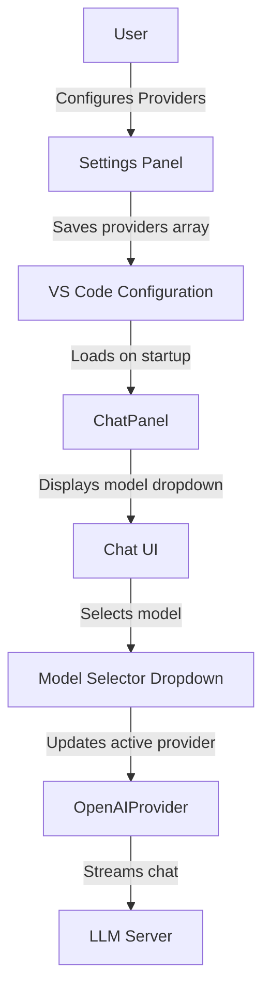

# Provider Configuration Plan

## Overview
Add support for multiple LLM providers with a user-friendly Settings panel UI. Users can configure multiple provider entries (each with name, baseUrl, model, toolUse, context) and select which one to use for chat via a dropdown in the chat UI.

## Architecture

### Mermaid Diagram


## Data Schema

### ProviderConfig Interface
```typescript
interface ProviderConfig {
  name: string;        // Display name, e.g., "qwen3-coder:a3b"
  baseUrl: string;     // e.g., "http://localhost:8080/v1"
  model: string;       // e.g., "qwen3-coder:a3b"
  apiKey?: string;     // Optional API key for this provider (default: "local")
  toolUse: boolean;    // Whether to enable tool use (default: true)
  context: number;     // Context window size (default: 32768)
}
```

### Configuration Storage
- Stored in VS Code extension settings under `agent86.providers`
- Default configuration includes one sample provider
- Persisted as global configuration (vscode.ConfigurationTarget.Global)

## Implementation Steps

### 1. Define TypeScript Interfaces
**File:** `src/config/ConfigManager.ts`

Add the ProviderConfig interface and extend ConfigManager to handle providers array.

### 2. Update Message Protocol
**File:** `src/chat/messageProtocol.ts`

Add provider-related types:
- `ExtensionToWebview`: 
  - Add `providers` and `activeProvider` to `openSettings` message
  - Add `providerStatus` message: `{ type: 'providerStatus'; providerName: string; status: 'online' | 'offline' | 'checking' }`
- `WebviewToExtension`: 
  - Add `saveSettings` message with providers array
  - Add `selectModel` message: `{ type: 'selectModel'; providerIndex: number }`

### 3. Update OpenAIProvider
**File:** `src/providers/OpenAIProvider.ts`

Modify constructor to accept either:
- Legacy mode: (baseUrl, model, apiKey, log)
- New mode: (config: ProviderConfig, apiKey, log)

### 4. Extend ChatPanel
**File:** `src/chat/ChatPanel.ts`

- Add `_activeProvider` state to track selected provider
- Update `_getProvider()` to use the active provider config
- Add methods to load/save providers from VS Code config
- Add message handler for model selection from dropdown
- Update `openSettings` to send providers array

### 5. Update Settings UI
**File:** `webview-ui/main.ts`

- Add "Providers" section in Settings panel
- Display list of providers with edit/delete/add functionality
- Add JSON editor or form fields for each provider property
- Add model dropdown selector (below thinking mode)

### 6. Handle Save Settings
**File:** `src/chat/ChatPanel.ts`

Update `saveSettings` handler:
- Save providers array to VS Code config
- Update active provider if changed

### 7. Model Selection with Health Check
When user selects a model from the dropdown:

1. **UI shows "Checking..." state** - Display a spinner/loading indicator next to the dropdown
2. **Extension performs health check** - Call the `/models` endpoint on the provider's baseUrl
3. **Display online/offline status** - Show visual indicator:
   - 🟢 Green dot: Provider is reachable and responding
   - 🔴 Red dot: Provider is unreachable or error
   - 🟡 Yellow dot: Check in progress

**Health Check Implementation:**
```typescript
async function checkProviderHealth(baseUrl: string): Promise<boolean> {
  try {
    const response = await fetch(`${baseUrl}/models`, {
      method: 'GET',
      signal: AbortSignal.timeout(5000) // 5 second timeout
    });
    return response.ok;
  } catch {
    return false;
  }
}
```

**Message Flow:**
1. Webview sends `selectModel` message with provider index/name
2. Extension shows "Checking..." status
3. Extension performs health check
4. Extension sends `providerStatus` message back to webview with online/offline status
5. Webview updates UI with status indicator

## UI Changes

### Settings Panel
```
┌─────────────────────────────────────┐
│ Settings                      ×     │
├─────────────────────────────────────┤
│ Provider URL                       │
│ [http://localhost:8080/v1        ] │
│                                     │
│ API Key                            │
│ [••••••••••••                    ] │
│                                     │
│ Model                              │
│ [qwen3-coder:a3b                 ] │
│                                     │
│ ─────────────────────────────────  │
│                                     │
│ Providers Configuration:           │
│ ┌────────────────────────────────┐ │
│ │ qwen3-coder:a3b    [Edit][×]  │ │
│ │ qwen3-coder:a3c    [Edit][×]  │ │
│ └────────────────────────────────┘ │
│ [+ Add Provider]                   │
│                                     │
│ Provider form fields:              │
│ - Name: text input                 │
│ - Base URL: text input             │
│ - Model: text input                │
│ - API Key: password input (optional)│
│ - Tool Use: checkbox               │
│ - Context: number input            │
│                                     │
├─────────────────────────────────────┤
│  Save    Cancel                     │
└─────────────────────────────────────┘
```

### Chat UI with Model Selector
```
┌─────────────────────────────────────────┐
│ [Select Session] [Attach Files]         │
│ [Attach Editor]                          │
├─────────────────────────────────────────┤
│ Model: [qwen3-coder:a3b ▼] ●           │
│   (● = green: online, red: offline)     │
├─────────────────────────────────────────┤
│                                         │
│ [Copy Markdown] [Copy Raw]              │
│ ┌─────────────────────────────────────┐ │
│ │ Assistant response...               │ │
│ │                                     │ │
│ └─────────────────────────────────────┘ │
├─────────────────────────────────────────┤
│ ┌─────────────────────────────────────┐ │
│ │ Ask the agent…                     │ │
│ └─────────────────────────────────────┘ │
│ [✓] Thinking mode  [ ] Include AGENTS.md│
│                      [Send] [Stop]       │
└─────────────────────────────────────────┘
```

**Model Selector with Health Check:**
- Dropdown shows all configured providers
- Each provider entry shows: name (e.g., "qwen3-coder:a3b")
- Status indicator (●) next to selected provider shows:
  - 🟢 Green: Online - provider is reachable
  - 🔴 Red: Offline - provider is not responding
  - 🟡 Yellow (with spinner): Checking connection...
- Health check runs when:
  1. User selects a different model from dropdown
  2. On initial load of the chat panel
  3. Optionally: periodic check every 30 seconds

## File Changes Summary

| File | Changes |
|------|---------|
| `src/config/ConfigManager.ts` | Add ProviderConfig interface |
| `src/providers/OpenAIProvider.ts` | Accept ProviderConfig object |
| `src/chat/messageProtocol.ts` | Add provider types to messages |
| `src/chat/ChatPanel.ts` | Multi-provider support, model selection |
| `webview-ui/main.ts` | Settings UI for providers, model dropdown |
| `package.json` | Add default providers configuration |

## Backward Compatibility

- If no providers configured, fall back to legacy single-provider settings
- Default to first provider in array if available
- Maintain existing `agent86.baseUrl`, `agent86.model`, `agent86.apiKey` for migration path
