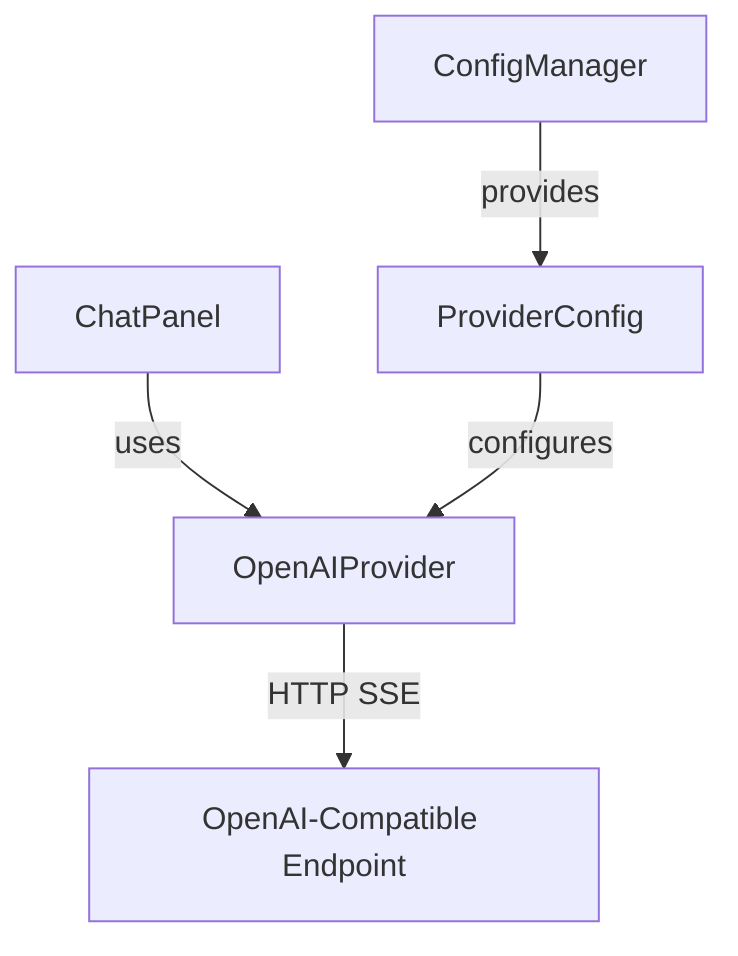
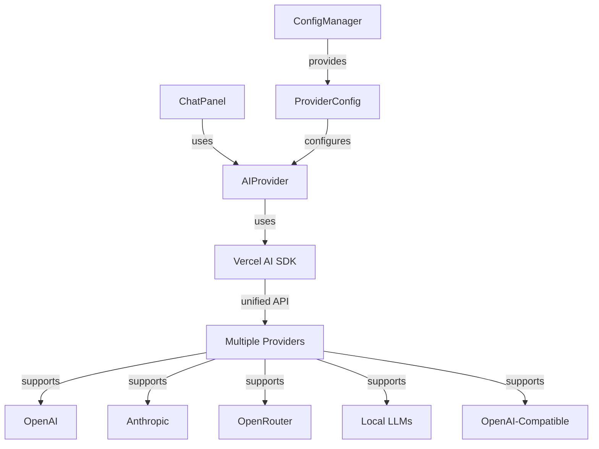

# Vercel AI SDK Migration Plan

## Overview

This plan outlines the migration from the current custom `OpenAIProvider` implementation to the Vercel AI SDK (`ai` package). The migration will provide a unified API across all supported providers while maintaining backwards compatibility with existing configurations.

## Current Architecture



## Target Architecture



## Supported Providers

| Provider | API Type | Authentication | Notes |
|----------|----------|----------------|-------|
| **OpenAI** | `openai` | API Key | Official OpenAI API |
| **Anthropic** | `anthropic` | API Key | Claude models via Anthropic API |
| **OpenRouter** | `openrouter` | API Key | Aggregates multiple providers |
| **Local LLMs** | `openai-compatible` | None/local | llama-server, LM Studio, Ollama |
| **Custom OpenAI-Compatible** | `openai-compatible` | Optional API Key | Any OpenAI-compatible endpoint |

## Implementation Steps

### Phase 1: Dependency Updates

1. **Add Vercel AI SDK dependencies**
   ```bash
   npm install ai
   ```
   
   Note: The `ai` package is designed for both Node.js and edge runtimes. For VS Code extension (Node.js), we need to ensure compatibility.

2. **Remove or deprecate old dependencies**
   - Consider removing `openai` npm package (v6.x) if no longer needed
   - Keep `@huggingface/tokenizers` for token counting

### Phase 2: Create New Provider Abstraction

**File:** `src/providers/AIProvider.ts` (new)

Create a new provider class that wraps the Vercel AI SDK. This class uses the `ProviderFactory` to get the appropriate Vercel AI SDK provider:

```typescript
import { streamText } from 'ai';
import { IProvider, ChatMessage, ProviderEvent, ProviderUsage, ILogger } from './IProvider';
import { ProviderConfig } from '../config/ConfigManager';
import { createProvider } from './ProviderFactory';

export class AIProvider implements IProvider {
  private readonly model: string;
  private readonly logger?: ILogger;
  private readonly provider: any; // Vercel AI SDK provider instance
  
  constructor(config: ProviderConfig, logger?: ILogger) {
    this.model = config.model;
    this.logger = logger;
    // Create the appropriate Vercel AI SDK provider
    this.provider = createProvider(config);
  }
  
  async stream(
    messages: ChatMessage[],
    signal: AbortSignal,
    onEvent: (event: ProviderEvent) => void,
    extraBody?: Record<string, unknown>
  ): Promise<void> {
    // Use Vercel AI SDK's streamText
    const result = streamText({
      model: this.model,
      messages: this.convertMessages(messages),
      ...extraBody,
      abortSignal: signal,
      onFinish: (completion) => {
        onEvent({
          type: 'done',
          usage: {
            promptTokens: completion.usage?.promptTokens ?? 0,
            completionTokens: completion.usage?.completionTokens ?? 0,
            totalTokens: completion.usage?.totalTokens ?? 0
          },
          finishReason: completion.finishReason
        });
      }
    });

    // Stream text deltas
    for await (const chunk of result.textStream) {
      onEvent({ type: 'delta', content: chunk });
    }
  }
  
  private convertMessages(messages: ChatMessage[]): any[] {
    // Convert our ChatMessage format to Vercel AI SDK format
    return messages.map(m => ({
      role: m.role,
      content: m.content
    }));
  }
}
```

### Phase 3: Provider Factory

**File:** `src/providers/ProviderFactory.ts` (new)

Create a factory that auto-detects the appropriate Vercel AI SDK provider from the URL. No config changes needed:

```typescript
import { createOpenAI, createAnthropic, createOpenRouter } from 'ai';
import { ProviderConfig } from '../config/ConfigManager';

/**
 * Creates a Vercel AI SDK provider instance based on configuration.
 * Auto-detects provider from URL - no explicit provider type needed.
 */
export function createProvider(config: ProviderConfig): any {
  const baseUrl = config.baseUrl;
  const apiKey = config.apiKey ?? 'local';
  
  // Detect which Vercel AI SDK factory to use from URL
  const providerType = detectProviderFromUrl(baseUrl);
  
  switch (providerType) {
    case 'anthropic':
      // Anthropic requires createAnthropic() - different API structure
      return createAnthropic({
        apiKey,
        baseURL: baseUrl || 'https://api.anthropic.com'
      });
    
    case 'openrouter':
      // OpenRouter uses OpenAI-compatible API but with different auth headers
      return createOpenRouter({
        apiKey,
        baseURL: baseUrl || 'https://openrouter.ai/api/v1'
      });
    
    case 'openai':
    case 'openai-compatible':
    default:
      // OpenAI and all OpenAI-compatible endpoints use createOpenAI()
      // This includes: OpenAI, local LLMs (llama-server, LM Studio, Ollama), custom endpoints
      return createOpenAI({
        apiKey,
        baseURL: baseUrl || 'https://api.openai.com/v1'
      });
  }
}

/**
 * Detects which Vercel AI SDK provider factory to use from URL.
 */
function detectProviderFromUrl(baseUrl: string): string {
  const url = baseUrl.toLowerCase();
  
  // Anthropic - MUST use createAnthropic() due to different API structure
  if (url.includes('anthropic.com')) {
    return 'anthropic';
  }
  
  // OpenRouter - uses OpenAI-compatible API but different auth
  if (url.includes('openrouter.ai')) {
    return 'openrouter';
  }
  
  // OpenAI
  if (url.includes('api.openai.com')) {
    return 'openai';
  }
  
  // Default: OpenAI-compatible (local endpoints, custom servers)
  return 'openai-compatible';
}
```

### Phase 4: Implement Streaming

The Vercel AI SDK provides `streamText()` which handles SSE streaming automatically:

```typescript
async stream(
  messages: ChatMessage[],
  signal: AbortSignal,
  onEvent: (event: ProviderEvent) => void,
  extraBody?: Record<string, unknown>
): Promise<void> {
  const result = streamText({
    model: this.model,
    messages: this.convertMessages(messages),
    ...extraBody,
    abortSignal: signal,
    onFinish: (completion) => {
      onEvent({
        type: 'done',
        usage: {
          promptTokens: completion.usage?.promptTokens ?? 0,
          completionTokens: completion.usage?.completionTokens ?? 0,
          totalTokens: completion.usage?.totalTokens ?? 0
        },
        finishReason: completion.finishReason
      });
    }
  });

  // Stream text deltas
  for await (const chunk of result.textStream) {
    onEvent({ type: 'delta', content: chunk });
  }
}
```

### Phase 5: Tool Calling Integration (Future Enhancement)

The Vercel AI SDK has built-in tool calling support. This is a future enhancement:

```typescript
// Example tool calling setup
import { tool } from 'ai';

const readFileTool = tool({
  description: 'Read a file from the workspace',
  parameters: z.object({
    path: z.string().describe('The file path to read')
  }),
  execute: async ({ path }) => {
    // Implementation
  }
});

const result = generateText({
  model,
  messages,
  tools: {
    readFile: readFileTool
  }
});
```

**Note:** The current implementation uses a custom XML-based tool calling format (`<RUN>`, `<EDIT>`, etc.). Migrating to Vercel AI SDK's native tool calling would require:
1. Defining tools using Vercel AI SDK's schema
2. Updating the system prompt to use the new tool format
3. Updating the action parsers to handle tool call results

This is marked as a future enhancement to keep the initial migration focused.

### Phase 6: No Configuration Schema Changes Needed

**File:** `src/config/ConfigManager.ts`

The existing `ProviderConfig` interface works as-is. The Vercel AI SDK's `ProviderFactory` will auto-detect the appropriate provider from the URL:

```typescript
// Existing config - no changes needed
export interface ProviderConfig {
  name: string;
  baseUrl: string;
  model: string;
  apiKey?: string;
  toolUse: boolean;
  context: number;
}
```

**How Vercel AI SDK Provider Detection Works:**

The `ProviderFactory` auto-detects which Vercel AI SDK factory to use based on the URL:

```typescript
function detectProviderFactory(baseUrl: string): string {
  const url = baseUrl.toLowerCase();
  
  // Anthropic - MUST use createAnthropic() due to different API structure
  if (url.includes('anthropic.com')) {
    return 'anthropic';
  }
  
  // OpenRouter
  if (url.includes('openrouter.ai')) {
    return 'openrouter';
  }
  
  // OpenAI
  if (url.includes('api.openai.com')) {
    return 'openai';
  }
  
  // Default: OpenAI-compatible (local endpoints, custom servers)
  return 'openai-compatible';
}
```

**No user-facing changes:** Users keep their existing configurations unchanged. The migration is entirely internal.

### Phase 7: No Package.json Changes Needed

**File:** `package.json`

No changes needed - the existing configuration schema works with the Vercel AI SDK's auto-detection.

### Phase 8: Backwards Compatibility

The migration is fully backwards compatible:

1. **No config changes:** Existing `ProviderConfig` works unchanged
2. **Auto-detection:** ProviderFactory detects provider from URL automatically
3. **Legacy settings:** Support existing `agent86.baseUrl` and `agent86.model` settings

```typescript
// Auto-detect which Vercel AI SDK factory to use from URL
function detectProviderFactory(baseUrl: string): string {
  const url = baseUrl.toLowerCase();
  
  // Local endpoints (llama-server, LM Studio, Ollama)
  if (url.includes('localhost') || url.includes('127.0.0.1')) {
    return 'openai-compatible';
  }
  
  // Anthropic - MUST use createAnthropic() due to different API structure
  if (url.includes('anthropic.com')) {
    return 'anthropic';
  }
  
  // OpenRouter - uses OpenAI-compatible API but different auth
  if (url.includes('openrouter.ai')) {
    return 'openrouter';
  }
  
  // OpenAI
  if (url.includes('api.openai.com')) {
    return 'openai';
  }
  
  // Default to openai-compatible
  return 'openai-compatible';
}
```

**Provider Factory Mapping:**

| URL Pattern | Vercel AI SDK Factory |
|-------------|----------------------|
| `localhost` / `127.0.0.1` | `createOpenAI()` |
| `api.openai.com` | `createOpenAI()` |
| `anthropic.com` | `createAnthropic()` |
| `openrouter.ai` | `createOpenRouter()` |
| (any other) | `createOpenAI()` |

## Provider-Specific Configuration

The existing `ProviderConfig` works for all providers. The Vercel AI SDK auto-detects the provider from the URL:

### OpenAI

```typescript
{
  name: "GPT-4",
  baseUrl: "https://api.openai.com/v1",
  model: "gpt-4-turbo",
  apiKey: "sk-...",
  toolUse: true,
  context: 128000
  // provider auto-detected from URL
}
```

### Anthropic

```typescript
{
  name: "Claude 3.5",
  baseUrl: "https://api.anthropic.com",
  model: "claude-3-5-sonnet-20241022",
  apiKey: "sk-ant-...",
  toolUse: true,
  context: 200000
  // provider auto-detected: createAnthropic() used
}
```

### OpenRouter

```typescript
{
  name: "OpenRouter Mixtral",
  baseUrl: "https://openrouter.ai/api/v1",
  model: "mistralai/mixtral-8x7b-instruct",
  apiKey: "sk-or-...",
  toolUse: true,
  context: 32000
  // provider auto-detected: createOpenRouter() used
}
```

### Local LLMs (llama-server, LM Studio, Ollama)

```typescript
{
  name: "Qwen 3",
  baseUrl: "http://127.0.0.1:8083/v1",
  model: "qwen3-8b-q4km",
  apiKey: "local",
  toolUse: true,
  context: 32768
  // provider auto-detected: createOpenAI() used (default)
}
```

**No user-facing changes:** Existing configurations work unchanged. The migration is entirely internal.

## File Changes Summary

| File | Action | Description |
|------|--------|-------------|
| `package.json` | Modify | Add `ai` dependency |
| `src/providers/AIProvider.ts` | Create | New provider using Vercel AI SDK |
| `src/providers/ProviderFactory.ts` | Create | Factory that auto-detects provider from URL |
| `src/providers/IProvider.ts` | Modify | Update interface if needed |
| `src/providers/OpenAIProvider.ts` | Deprecate | Keep for backwards compatibility, mark as deprecated |
| `src/config/ConfigManager.ts` | No changes | Existing config works unchanged |
| `src/chat/ChatPanel.ts` | Modify | Switch to use new AIProvider |
| `webview-ui/main.ts` | No changes | Existing UI works unchanged |

## Migration Phases

### Phase 1: Core Migration (Priority: High)
- [ ] Add Vercel AI SDK dependency
- [ ] Create AIProvider class
- [ ] Create ProviderFactory
- [ ] Update ChatPanel to use new provider
- [ ] Test with local LLMs (llama-server, LM Studio)

### Phase 2: Multi-Provider Support (Priority: High)
- [ ] Add OpenAI support
- [ ] Add Anthropic support
- [ ] Add OpenRouter support
- [ ] Update configuration UI

### Phase 3: Tool Calling Enhancement (Priority: Medium)
- [ ] Define tools using Vercel AI SDK schema
- [ ] Update system prompt
- [ ] Handle tool call results

### Phase 4: Cleanup (Priority: Low)
- [ ] Remove deprecated OpenAIProvider
- [ ] Clean up old code
- [ ] Update documentation

## Error Handling

The Vercel AI SDK provides better error handling. Update error handling in ChatPanel:

```typescript
// Vercel AI SDK errors are more descriptive
import { AIError, RateLimitError, AuthenticationError } from 'ai';

try {
  // Provider calls
} catch (error) {
  if (error instanceof RateLimitError) {
    onEvent({ type: 'error', message: 'Rate limit exceeded. Please wait.' });
  } else if (error instanceof AuthenticationError) {
    onEvent({ type: 'error', message: 'Invalid API key. Please check settings.' });
  } else {
    onEvent({ type: 'error', message: error.message });
  }
}
```

## Testing Checklist

- [ ] Test with llama-server on Windows
- [ ] Test with LM Studio on Windows
- [ ] Test with OpenAI API
- [ ] Test with Anthropic API
- [ ] Test with OpenRouter
- [ ] Test provider switching
- [ ] Test error handling for each provider
- [ ] Test backwards compatibility with existing configs